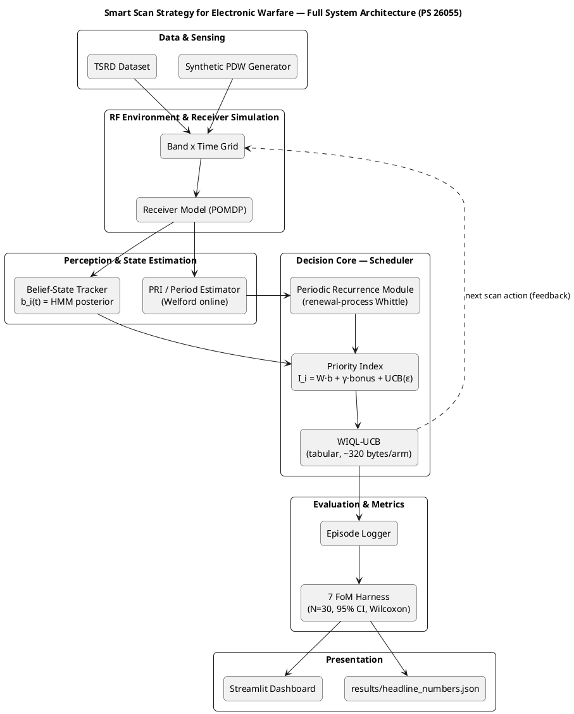

# System Architecture

**SIH 2026 PS 26055 — Smart Scan Strategy for Electronic Warfare**
**Team Coding Saints, ID 120303**

---

## Priority Index Formula

```
I_i(t) = W_i · b_i(t)  +  γ · periodic_bonus_i(t)  +  max(c·√(ln t / N_i(t)), ε)
         ─────────────    ──────────────────────────    ──────────────────────────
          Belief value       Periodic recurrence              UCB exploration
                                   bias                    (floor ε = 0.01)
```

The scheduler scans the top-K bands by I_i(t) each time step.

---

## PlantUML Diagram



---

## Component Summary

| Component | File | Purpose |
|---|---|---|
| WIQL-UCB Scheduler | `ew_smart_scan/env/wiql_ucb.py` | Tabular Whittle-index Q-learning with UCB |
| Belief Tracker | `ew_smart_scan/env/belief_tracker.py` | HMM POMDP belief state (p_detect=0.9, p_fa=0.01) |
| Periodic Module | `ew_smart_scan/env/periodic_intercept.py` | Renewal-process Whittle index, Welford estimator |
| RF Environment | `ew_smart_scan/env/rf_environment.py` | POMDP wrapper — TSRD or synthetic data |
| Receiver Model | `ew_smart_scan/env/receiver_model.py` | POMDP gating — unscanned bands return empty obs |
| Evaluation Harness | `ew_smart_scan/eval/evaluation.py` | 7 FoMs, per-step recording |
| Statistical Harness | `harness/runner.py` | N=30 seeds, bootstrap CI, Wilcoxon signed-rank |
| Streamlit Demo | `demo/app.py` | Live interactive visualization (2 tabs) |
| Public API | `src/` | Clean re-export package for external use |

---

## Belief Update Equations

**Parameters:** p_stay_occ = 0.9, p_stay_idle = 0.85, p_detect = 0.9, p_fa = 0.01

**Chapman-Kolmogorov (always applied, even to unscanned bands — "restless" property):**
```
b_pred = p_stay_occ · b(t) + (1 - p_stay_idle) · (1 - b(t))
       = 0.9 · b(t) + 0.15 · (1 - b(t))
```

**Bayesian update on hit (obs=1):**
```
b(t+1) = [p_detect · b_pred] / [p_detect · b_pred + p_fa · (1 - b_pred)]
        = [0.9 · b_pred] / [0.9 · b_pred + 0.01 · (1 - b_pred)]
```

**Bayesian update on miss (obs=0):**
```
b(t+1) = [(1 - p_detect) · b_pred] / [(1 - p_detect) · b_pred + (1 - p_fa) · (1 - b_pred)]
```

**Not scanned:** b(t+1) = b_pred (Chapman-Kolmogorov only)

---

## WIQL-UCB Design Notes

- **Belief discretization:** 16 uniform bins per band (~128 bytes Q-table per arm in float32)
- **Q-learning:** TD(0) with harmonic learning rate 1/(N+1) — self-tuning, no hyperparameter
- **Whittle index update:** two-timescale, alpha_w=0.05 (slow) vs Q learning rate (fast)
- **UCB bonus:** c·√(ln t / N_i(t)), c=1.0 (standard UCB1); +inf for unvisited pairs
- **Exploration floor:** ε=0.01 prevents permanent band lockout in non-stationary environments
- **Memory per arm:** ~320 bytes (16 bins × 2 actions × float32 Q + visit counts + index)
- **Latency:** ~24 μs/step at K=8 (tabular Python; compatible with EW latency budgets)

---

## Periodic Module Design Notes

- **Period estimator:** Welford online algorithm — O(1) memory, numerically stable on large ToA values
- **Minimum samples:** 3 inter-arrivals (n≥3) before any index is computed
- **Whittle-style index:** based on renewal reward R_f(t) = max(0, 1 − |t_now − t_expected| / μ)
- **Dwell window:** ±3σ around predicted arrival (6σ total, per SpecInsight NSDI'15)
- **Index merging:** rank-based with weight α=0.5 (periodic gets half the weight of WIQL)
- **Isolation:** Module C has NO shared mutable state with BeliefTracker or WIQLScheduler (Property 4)

---

## TSRD Grounding

Emitter parameters are extracted from the Turing Synthetic Radar Dataset (TSRD):
- **Periodic emitters (2 characterised instances):**
  - Class P1: T = 1511.5 μs, σ = 133.2 μs (CoV = 8.8%)
  - Class P2: T = 502.5 μs, σ = 35.9 μs (CoV = 7.1%)
- **Background emitters:** CoV ≥ 1.0 — irregular renewal, modelled as Bernoulli(p), p ~ Beta(1,3)
- **Note:** Two periodic instances is a thin statistical basis — disclosed in `docs/limitations.md`

TSRD is available at: https://huggingface.co/datasets/alan-turing-institute/turing-synthetic-radar-dataset
